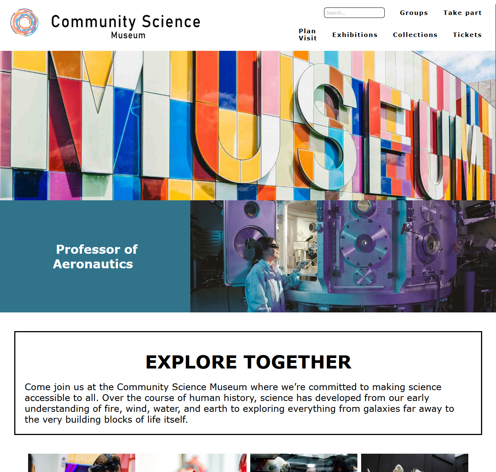

# SemesterProject 1 - Community Science Museum



## Description

The aim of the website is to let the user explore the wonders of science with the Community Science Museum website. An engaging platform designed for primary and middle school children, ages 7-15, and families. Discover captivating exhibits, plan your visit, and spark curiosity in the world of science.

## Built With

The website is developed using VS Code. The repository is hosted on my GitHub profile, and the live version is deployed on [Netlify](https://glittery-eclair-b4f4cf.netlify.app/).

### Tech Stack

- WordPress
- VS Code

### Getting Started

#### Installing

To get started, clone the repo:

<!-- ```bash
git clone https://github.com/BergitTveit/Semester-Project -->

#### Running

The recommended way of running is to install [Visual Studio Code](https://code.visualstudio.com/)
For visual aid it is also recommened to install the following plugin [Live Server](https://github.com/ritwickdey/vscode-live-server-plus-plus)

### Contributing

If you'd like to contribute to the project, please follow these steps:

1. Fork the repository.
2. Create a new branch.
3. Make your changes.
4. Open a pull request for review.

### Connect with Me

- LinkedIn: [](https://www.linkedin.com/in/bergit-tveit-672588152)
- Instagram (Business): [Lykke & Liten](https://www.instagram.com/lykkeogliten/)
- Instagram (Personal): [Leafing in the Moment](https://www.instagram.com/leafinginthemoment/)

#### Acknowledgments

--
